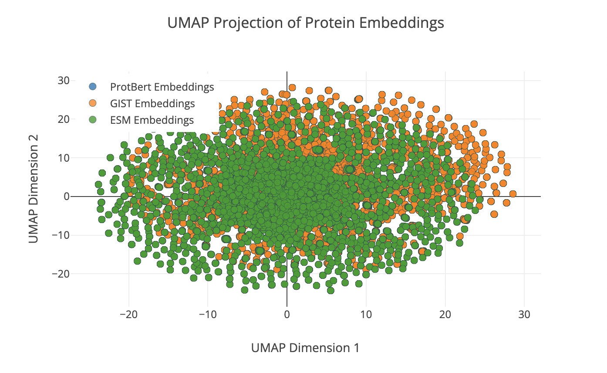
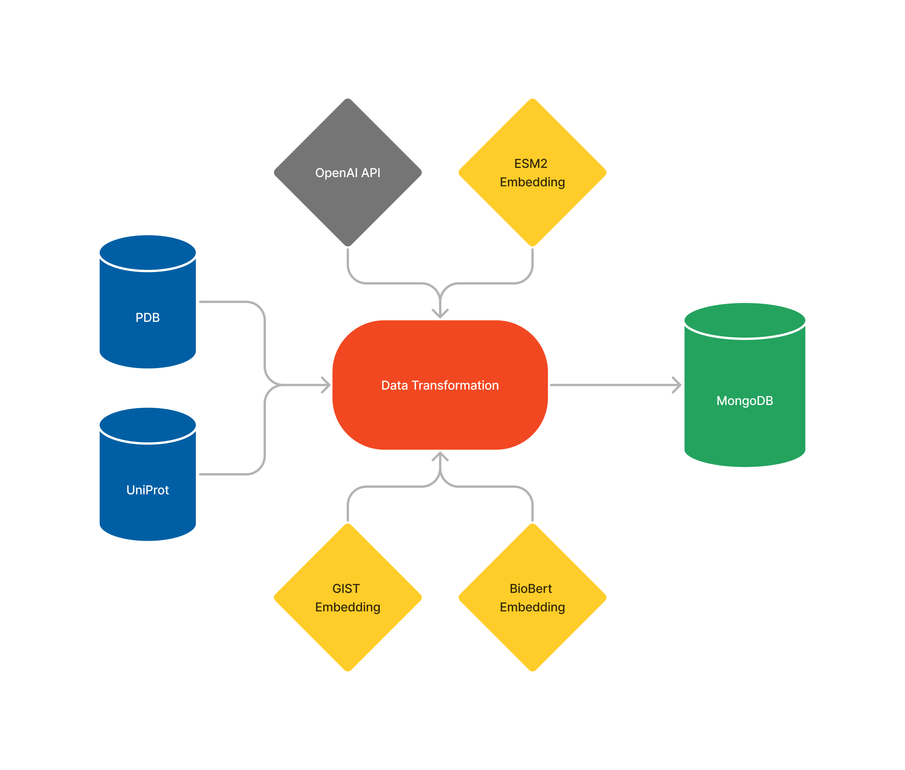
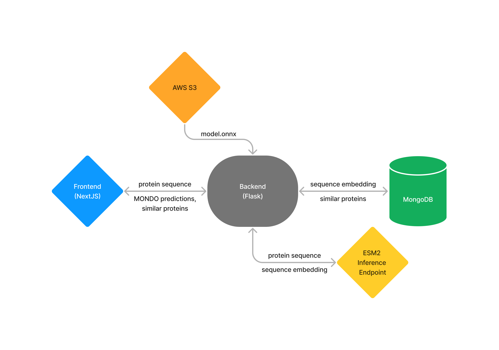

# Protein Explorer

Author: Daniel Medina

Deployed app: https://proteinexplorer.vercel.app/

Deployed frontend repo: https://github.com/medinardaniel/prot-explorer-frontend

Deployed backend repo: https://github.com/medinardaniel/prot-explorer-backend

## Goal
How can we use protein sequence embeddings to help researchers further understand relationships between different kinds of proteins? In this project, I use ESM2, a protein language model, to embed a given protein sequence predict MONDO Annotations given a protein sequence. In addition, I use the same embedding to query similar proteins.

## Modeling Approaches

### 1. Classical Approach

#### Features
* **TF-IDF Vectorization**: Text data is transformed using TF-IDF to understand the importance of words in documents relative to the dataset.

#### Model
* **Support Vector Machine (SVM)**: Uses an SVM with a linear kernel, employing the One-vs-Rest strategy for multi-label classification, suitable for high-dimensional data.

#### Evaluation Metrics
* **Accuracy**: 0.457
* **Precision**: 0.601
* **Recall**: 0.629
* **F1-Score**: 0.587

### 2. Naive Deep Learning Approach

#### Model Architecture
* **Embedding Layer**: Converts token indices into dense vectors of fixed size.
* **Flatten Layer**: Flattens the output from the embedding layer.
* **Dense Layer**: One hidden layer with ReLU activation.
* **Output Layer**: Final layer using sigmoid activation to predict the presence of each label independently.

#### Evaluation Metrics
* **Accuracy**: 0.323
* **Precision**: 0.973
* **Recall**: 0.939
* **F1-Score**: 0.931

### 3. Deep Learning Approach (Deployed)

#### Features
* **ESM2 Embeddings**: Custom protein sequence embeddings presumed to better represent protein sequences. Typically used for predicting structure and function in research settings.

#### Model Architecture
* **Custom ESM2 Embedding Layer**: Embeds protein sequences into a high-dimensional space tailored to capture biological semantics.
* **Dense Layers**: Multiple layers with non-linear activations to process the embedded data.
* **Normalization Layers**: Layer normalization to stabilize and accelerate the training.
* **Output Layer**: Uses sigmoid activation tailored for multi-label classification.

#### Evaluation Metrics
* **Accuracy**: 0.867
* **Precision**: 0.992
* **Recall**: 0.980
* **F1-Score**: 0.977

## Uniform Manifold Approximation and Projection (UMAP)
UMAP (Uniform Manifold Approximation and Projection) is a dimensionality reduction technique that approximates high-dimensional data's manifold structure and projects it into a lower-dimensional space for analysis and visualization. In addition to building a model that predicts protein MONDO annotations, I also projected three different protein embeddings into a 2D space to observe their distributions.

## Data

### Data Sources
* **Proteins**: Sourced from PDB (Protein Data Bank) [RCSB PDB](https://www.rcsb.org/).
* **Annotations**: Sourced from UniProt [UniProt](https://www.uniprot.org/).

Note: A few examples of the sourced protein data can be found in data/protein-data. For the rest of the data, please feel free to reach out.

### Data Pipeline
1. **Extract**: Downloaded files from PDB containing entry IDs for ~64,000 proteins found in the human body. Then wrote a script that used those Entry IDS to get protein sequence, name, function, and entity IDs for each protein associated with those entry IDs via PDB APIs. Finally, I then used the extracted protein entry IDs and entity IDs to find the Mondo annotations for each protein sequence via UniProt APIs.

2. **Transform**: Aggregated all protein data to create a dataframe that included entry ID, entity ID, sequence, name, function, embeddings, binding sites, and mondo annotations. Embedded protein sequences using GIST, ESM2, BioBert HuggingFace APIs and used the OpenAI API to create a shortened/summarized version of the function description text.

3. **Load**: Loaded the data into a MongoDB database collection to use in deployment and to query for training jobs.

### Data Storage
- Stored in a MongoDB database.
- Vector search indices were created to perform vector similarity search.

## Deployment

### General System Architecture
The deep learning model was deployed using the following architecture:

* **Frontend**: Created using the NextJS framework and deployed using Vercel, providing a user-friendly interface for interaction.

* **Backend**: Deployed in a Flask application where the model runs. The backend was deployed on Heroku.

* **Embedding Generation**: Utilizes a dedicated Hugging Face ESM2 endpoint to embed protein sequences.

* **Similar Protein Search**: Similar proteins are searched via MongoDB's Atlas Vector Search, which acts as a vector database at inference time.

### Deep Learning Model Deployment Strategy
 Heroku has a memory limit of 500 MB per application. Rather than shifting to a deployment platform that allowed me to use more space, I wanted to challenge myself to find ways to optimize my system to decrease the memory overhead and be able to deploy without going over this limit. To do this, I had to find a way to do model inference on my Pytorch model without the Pytorch python package, which usually takes up over 2 GB in RAM. Here's what I did to deploy successfully:

    - **ONNX Inference**: I converted my model to ONNX format, an open-source AI ecosystem that allows you to run language-agnostic inferences on models. This eliminated the need for using the Pytorch package.

    - **AWS S3 Model Rendering**: Pushing my 111 MB model to GitHub and then deploying to Heroku via a CI/CD pipeline caused issues. GitHub uses GitHub Large Files System (LFS) to handle files over 100 MB, and Heroku doesn't interact well with this. To address this, I decided to upload my model to an AWS S3 bucket and download it during runtime.

    - **Limited application to one dyno**: In Heroku, a dyno is a lightweight Linux container that runs a single user-specified command. When you have one dyno running, it means you have one instance of your application operating on Heroku's platform. Having only one dyno means your application is up and running, but it may struggle to handle a high volume of traffic or provide redundancy in case of failure. However, since I'm not expecting my application to experience high traffic, it makes sense to use only one, as it allows me to save on memory.